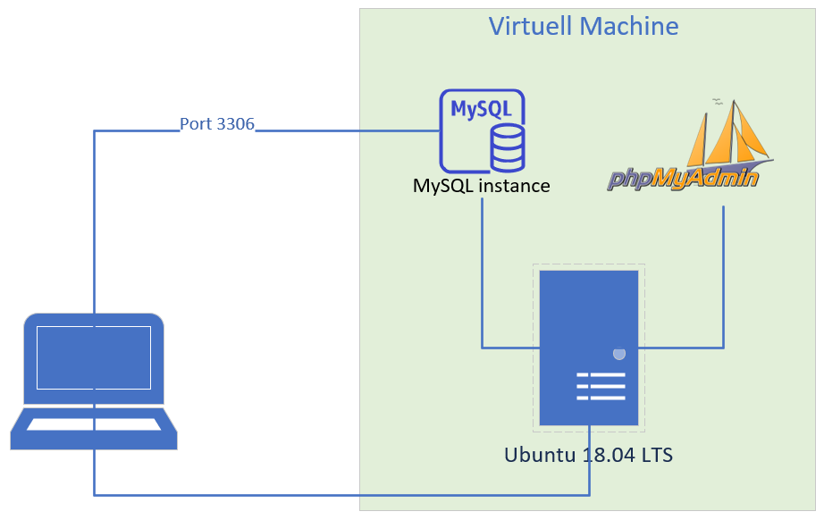
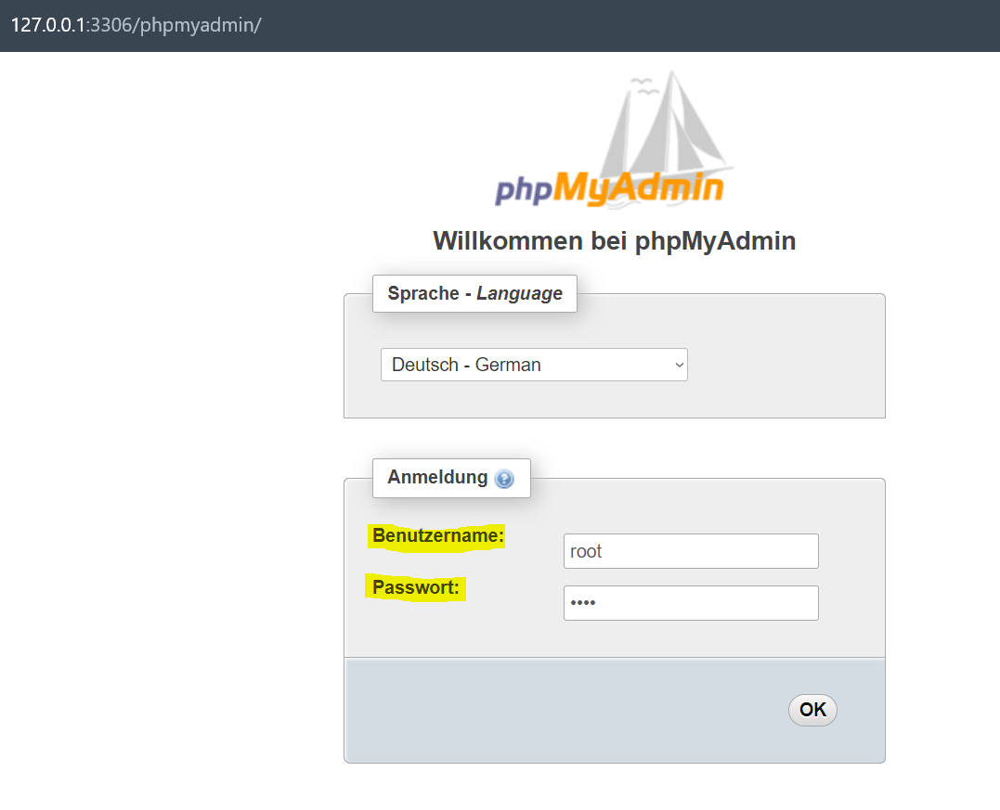
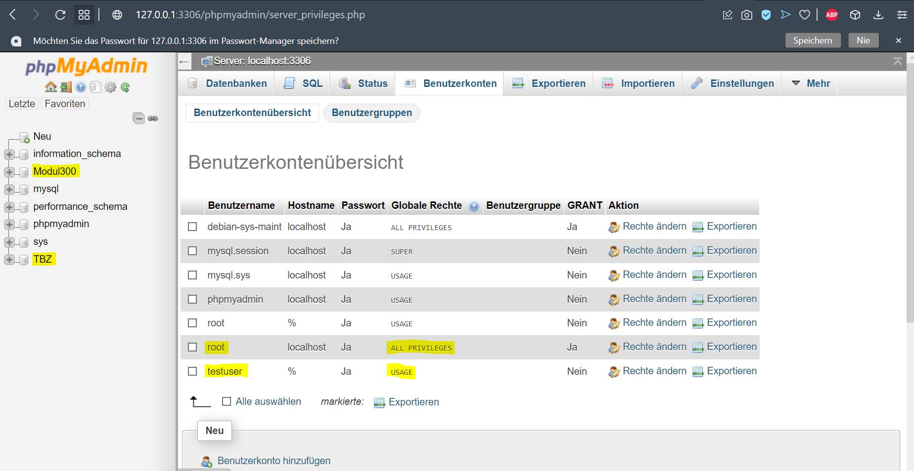
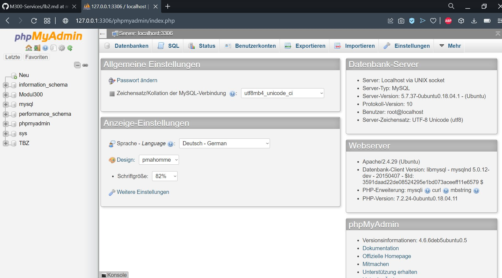

# **Dokumentation LB2**

---

# Inhaltsverzeichnis

- [Einführung](#einführung)
- [Grafische Übersicht des Services](#grafische)
- [Code](#code)
	- [Code-Quelle](#code-quelle)
	- [Vagrantfile](#vagrantfile)
	- [Bootstrap.sh](#bootstrap)
- [Service Anwendung](#anwendung)
- [Service testen](#testen)

---

# Einführung

Ich habe mich für das Projekt **MySQL automatisch einrichten** entschieden.
Mein Projekt umfasst die Virtualisierung und Automatisierung von Ubuntu zum Ausführen eines MySQL-Servers.
Damit es angenehmer ist die MySQL-Datenbank und ihre Benutzer zu verwalten und zu konfigurieren
habe ich mich entschieden noch einen GUI mit einzubinden. Dazu verwenden ich das webbasierte 
phpmyadmin.

---

# Grafische Übersicht des Services

---

# Code

## Code-Quelle

Ich habe die Anleitung, [HIER](https://www.yourtechy.com/technology/mysql-server-vagrant-virtualbox/)
auf dieser Seite gefunden. Dort wird der Code für das vagrantfile und das bootstrap.sh aufgezeigt. 
Ich habe aber Änderungen vorgenommen an beiden Files, d.h sie sind nicht eins zu eins gleich wie auf der Seite beschrieben ist.

Ich werde nun meine beiden files aufzeigen und erklären, was welcher Schritt macht. 

## Vagrantfile

Mein Vagrantfile sieht folgendermassen aus:

    Vagrant.configure("2") do |config|
    
      # General Vagrant VM configuration
      config.vm.box = "ubuntu/bionic64"

      config.vm.define "db-server" do |db|
        db.vm.network :forwarded_port, guest: 3306, host: 3306
        db.vm.network :forwarded_port, guest: 80, host: 3306
        db.vm.provision "shell", path: "bootstrap.sh"
      end

      # Adjustment for VM
      config.vm.provider :virtualbox do |vb|
        vb.customize [
            'modifyvm', :id,
            '--natdnshostresolver1', 'on',
            '--memory', '1024',
            '--cpus', '4'
        ] 
      end
    end

| Code| Beschreibung|
| --------------| -----------------|
| Vagrant.configure("2") do config | Diese Zeile im Code beschreibt die API Version, in diesem Fall die Nummer 2, vom Vagrantfile. In diesem Block beschreibe ich die VM Konfigurationen die ich vornehmen werde.  |
| config.vm.box | Hier habe ich mich für ein Betirebssystem entscheiden, welches ich auf der VM laufen haben möchte. |
| db.vm.network | Da definiere ich den Port auf welchen dann die VM zugreift. In diesem Fall wäre es für MySQL Port 3306 und für die Webapplikation phpmyadmin Port 80.  |
| db.vm.provision | In diesem Schritt erlaube ich die Ausführung von einem Shell Skript, in meinem Fall das bootstrap.sh file, nachdem das Guest OS gebootet hat. |
| config.vm.provider :virtualbox do vb | Hier definiere ich den Provider der VM, in diesem Fall Virtualbox. Zusätzlich habe ich noch Anpassungen gemacht, z.b mehr RAM und CPUs. |

## Bootstrap.sh

Mein bootstrapfile sieht folgendermassen aus:

    DBHOST=localhost
    DBNAME1=Modul300
    DBNAME2=TBZ
    DBROOTUSER=root
    DBROOTPASSWD=root
    DBUSER=testuser
    DBPASSWD=test123

    apt-get update
    debconf-set-selections <<< "mysql-server mysql-server/root_password password $DBROOTPASSWD"
    debconf-set-selections <<< "mysql-server mysql-server/root_password_again password $DBROOTPASSWD"
    debconf-set-selections <<< "phpmyadmin phpmyadmin/dbconfig-install boolean true"
    debconf-set-selections <<< "phpmyadmin phpmyadmin/app-password-confirm password $DBROOTPASSWD"
    debconf-set-selections <<< "phpmyadmin phpmyadmin/mysql/admin-pass password $DBROOTPASSWD"
    debconf-set-selections <<< "phpmyadmin phpmyadmin/mysql/app-pass password $DBROOTPASSWD"
    debconf-set-selections <<< "phpmyadmin phpmyadmin/reconfigure-webserver multiselect none"

    apt-get -y install mysql-server phpmyadmin

    mysql -uroot -p$DBROOTPASSWD -e "CREATE DATABASE $DBNAME1"
    mysql -uroot -p$DBROOTPASSWD -e "CREATE DATABASE $DBNAME2"
    mysql -uroot -p$DBROOTPASSWD -e "grant all privileges on $DBNAME1.* to '$DBROOTUSER'@'%' identified by '$DBROOTPASSWD'"
    mysql -uroot -p$DBROOTPASSWD -e "grant all privileges on $DBNAME2.* to '$DBROOTUSER'@'%' identified by '$DBROOTPASSWD'"
    mysql -uroot -p$DBROOTPASSWD -e "grant select on $DBNAME1.* to '$DBUSER'@'%' identified by '$DBPASSWD'"
    mysql -uroot -p$DBROOTPASSWD -e "grant select on $DBNAME2.* to '$DBUSER'@'%' identified by '$DBPASSWD'"

    cd /vagrant

    sudo sed -i "s/.*bind-address.*/bind-address = 0.0.0.0/" /etc/mysql/mysql.conf.d/mysqld.cnf

    sudo service mysql restart

    service apache2 restart

| Code | Beschreibung |
| --------------| -----------------|
| DBHOST=localhost | Ganz am Anfang habe ich die Variablen definiert, die ich dann später im Code einsetzten werde. Ich habe zum einen den Datenbank Host und Namen definiert sowie den Datenbank User und Passwort.  |
| debconf-set-selections ... | Wenn man den Service selber mal manuell installieren würde, dann wären diese Konfigurationen genau die gleichen. Hier geht es nur drum das root passwort einzugeben damit man dann auch alles installieren kann.|
| apt-get -y install mysql-server phpmyadmin | Nun wird der mysql Service bzw. mysql-server und phpmyadmin installiert. |
| sudo sed -i "s/.*bind-address.*/bind-address = 0.0.0.0/" /etc/mysql/mysql.conf.d/mysqld.cnf | Die mysql konfig wird nun ergänzt, so dass man auf die Datenbank per Remote zugreifen kann. |

---

# Service Anwendung

Um den Service anwenden zu können ist es ganz simpel. Man muss folgendes tun:

1. Folgenden Befehl auf Git Bash ausführen: `vagrant up`
2. Sobald die VM aufgesetzt wurde folgenden Link aufrufen: http://127.0.0.1:3306/phpmyadmin
3. Sich mit folgenden Anmeldedaten anmelden:
   - Benutzername: root
   - Passwort:     root

4. Wenn man nun auf Benutzerkonten geht sieht man die zwei User "root" & "testuser" die auch verschiedene Berechtigungen haben. Sowie in der linken Spalte sieht man die zwei Datenbanken "TBZ" & "Modul300", welche auch erstellt wurden. Hier noch ein Bild:

---

# Service testen

Testen können wir den Service nachdem wir `vagrant up` gemacht haben und auf die Seite http://127.0.0.1:3306/phpmyadmin zugreifen.
Wenn dort ein Anmeldefenster kommt und man sich mit dem Benutzernamen *root* und Passwort *root* oder mit dem anderen Benutzer *testuser* und Passwort *test123* anmelden kann, dann funktioniert der Service.
Wenn man nun das Interface sieht von phpmyadmin dann funktioniert es:

---

