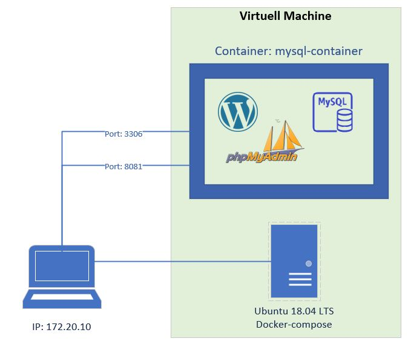
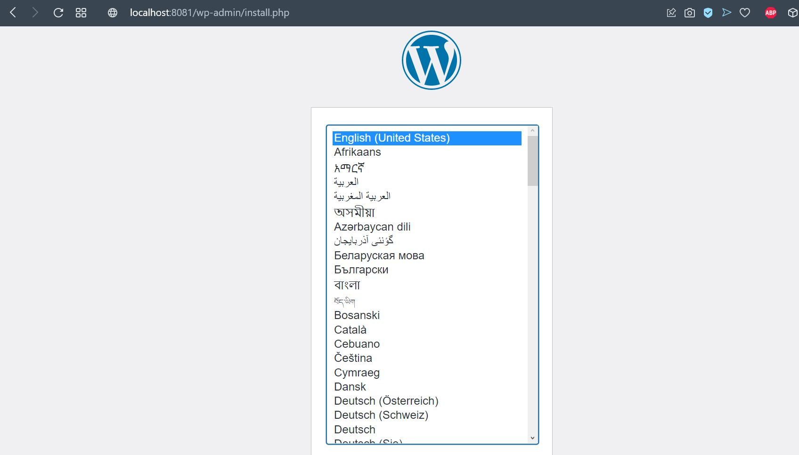
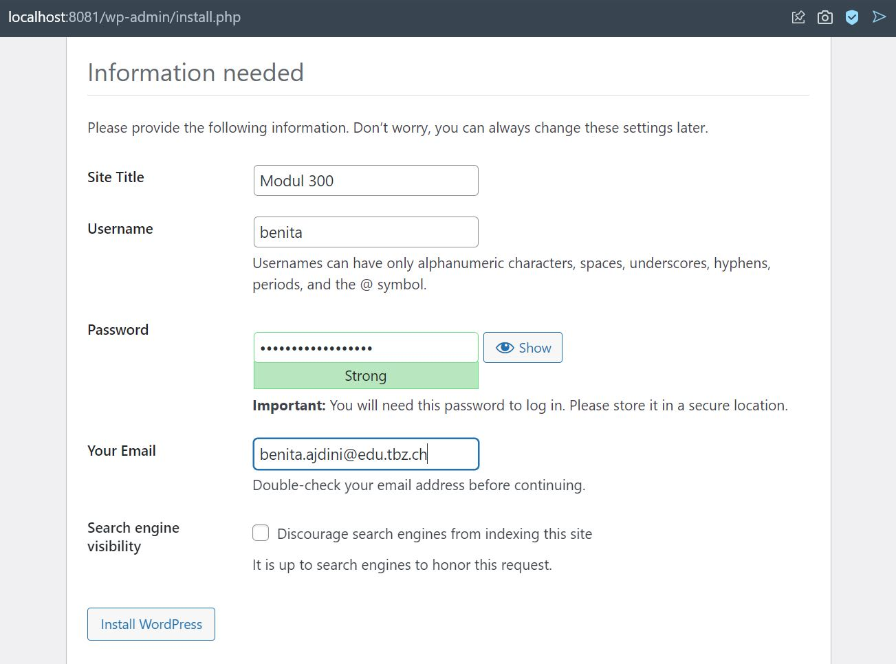
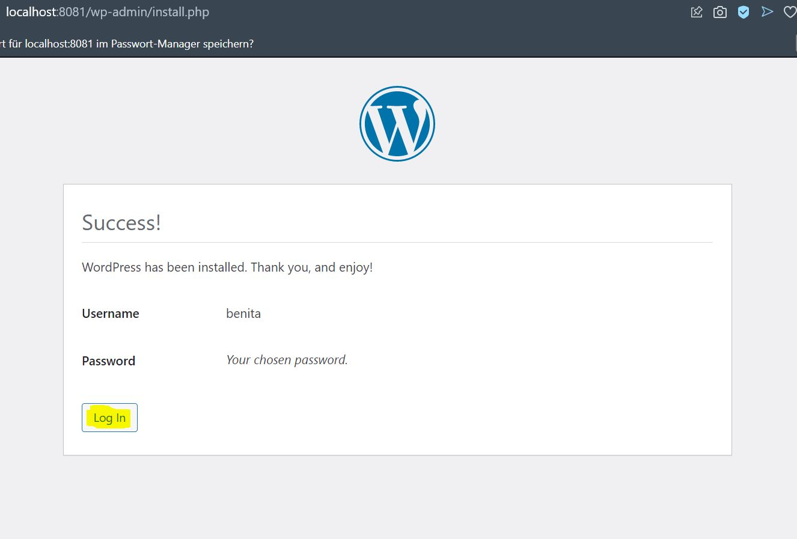
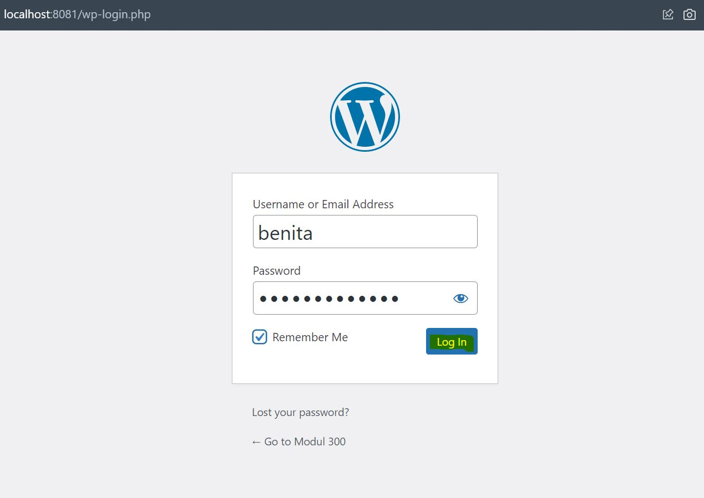
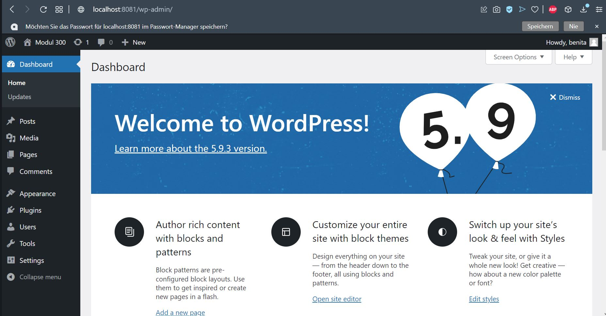
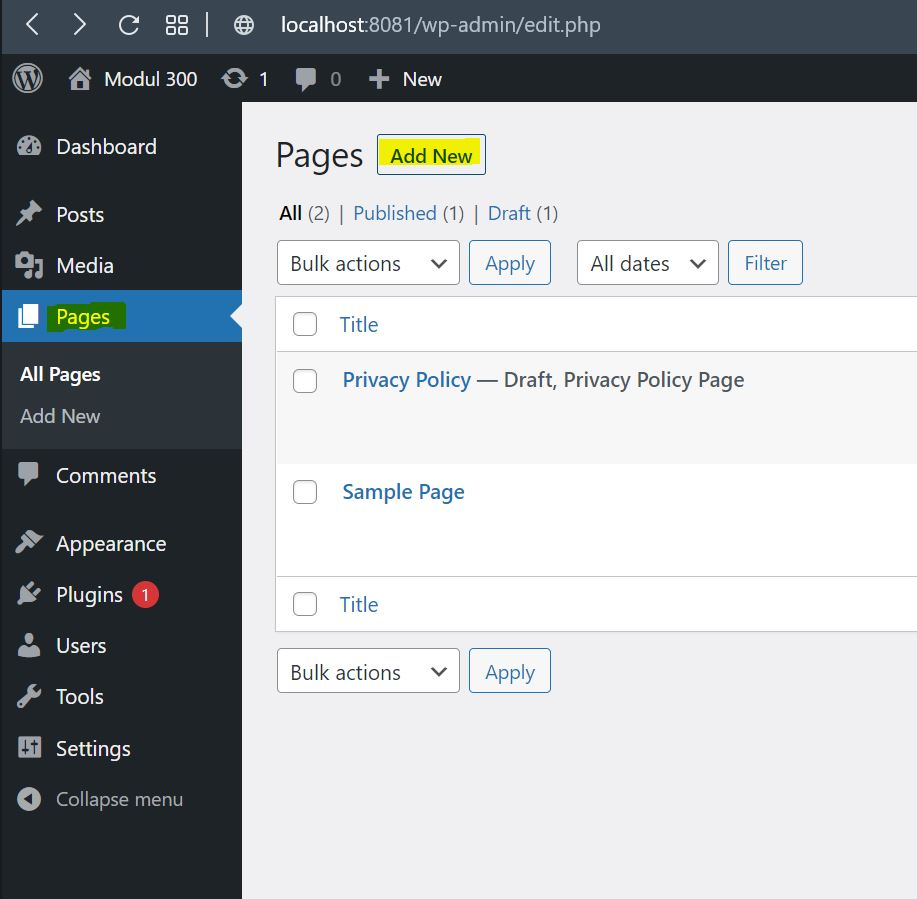
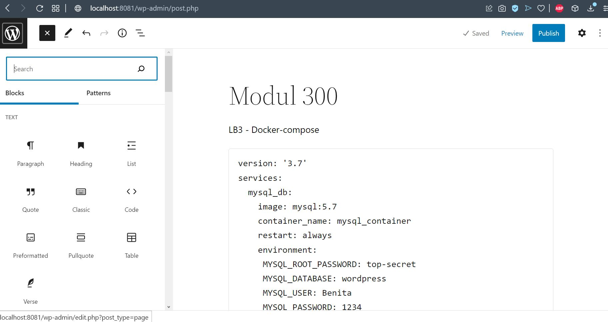
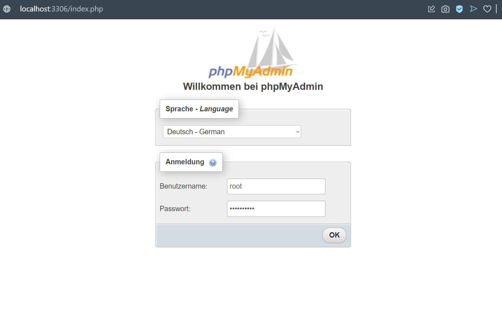
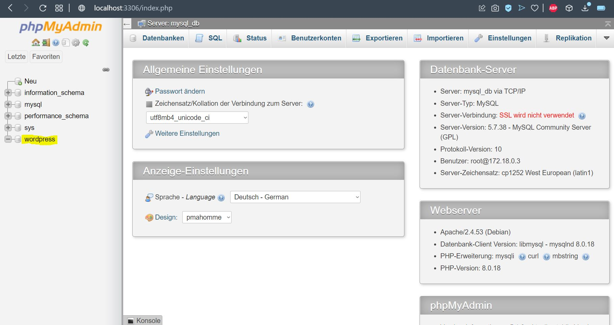

# **Dokumentation LB3**

---

# Inhaltsverzeichnis

- [Einführung](#einführung)
- [Grafische Übersicht des Services](#grafische)
- [Code](#code)
	- [Code-Quelle](#code-quelle)
	- [Docker-compose.yml](#compose)
- [Service Anwendung](#anwendung)
- [Service Testen](#testen)

---

# Einführung
Ich habe mich für das Projekt **Wordpress mit MySQL und phpMyAdmin in Docker bereit zu stellen** entschieden.
Als Resultat werde ich einen Multi-Container-WordPress-Anwendung haben. Als Datenbankdienste für WordPress verwende ich Mysql und Phpmyadmin.

---

# Grafische Übersicht des Services

---

# Code

## Code-Quelle
Ich habe mein docker-compose File mit Hilfe von docker hub erstellt. Folgende Seiten habe ich als Hilfe benutzt:
- https://hub.docker.com/_/mysql
- https://hub.docker.com/_/phpmyadmin
- https://hub.docker.com/_/wordpress

## Docker-compose.yml

    version: '3.7'
    services:
      mysql_db:
        image: mysql:5.7
        container_name: mysql_container
        restart: always
        environment:
         MYSQL_ROOT_PASSWORD: top-secret
         MYSQL_DATABASE: wordpress
         MYSQL_USER: Benita
         MYSQL_PASSWORD: 1234
        volumes:
         - mysql:/var/lib/mysql

      wordpress:
        depends_on:
         - mysql_db
        image: wordpress:latest
        restart: always
        ports:
         - "8081:80"
        environment:
         WORDPRESS_DB_HOST: mysql_db:3306
         WORDPRESS_DB_USER: Benita
         WORDPRESS_DB_PASSWORD: 1234
         WORDPRESS_DB_Name: wordpress
        volumes:
         - "./:/var/www/html"

      phpmyadmin: 
        depends_on:
         - mysql_db
        image: phpmyadmin
        restart: always
        ports:
         - 3306:80
        environment:
         PMA_HOST: mysql_db
         MYSQL_ROOT_PASSWORD: top-secret
        volumes:
         - "./:/var/www/html/phpmyadmin"

    volumes:
      mysql: {}

| Code| Beschreibung|
| --------------| -----------------|
|container name:|Name des Containers.|
|image:|Das image wird von dockerhub heruntergeladen.|
|restart: always|Wenn der Container zerstört wird, wird er automatisch neu gestartet. Dies kann passieren, wenn Sie Ihren Computer neu starten.|
|environment:|Hier definieren wir die Umgebungsvariabelan umden Mysql-Container auszuführen, auf den aus der Docker-Dokumentation verwiesen wird.|
|volumes:|Wir werden dieses Volume dauerhaft machen, damit unsere Daten zwischen dem Neustart oder der Zerstörung des Containers überleben. Also es dient dazu aber weiter unten definieren wir nochmals eins.|
|depends_on:|Der WordPress-Container wird nur gestartet, wenn der mysql_db-Dienst bereits gestartet wurde.|
|ports:|Port angegeben, die Ports sollten schon offen sein auf der VM (Vagrantfile vor definiert)|

---

# Service Anwendung

Um den Service anwenden zu können ist es ganz simpel. Man muss folgendes tun:

1. Folgenden Befehl auf docker ausführen: `docker-compose up -d`
2. Nachdem alles fertig aufgesetzt wurde kann man folgenden Link für Wordpress aufrufen: **localhost:8081**
3. Nun sollte man auf die Wordpress Seite gelangen. Man muss nur noch kurz ein Login erstellen, dies zeige ich mit folgenden Bildern auf:

4. Man kann nun testen, ob Wordpress auch wirklich funktioniert. Hier werde ich testen, ob man eine neue Seite erstellen kann, dies zeige ich mit den folgenden Bildern auf:

Siehe da es funktioniert :)

5. Phpmyadmin kann man auch teste, ob wir auch Zugriff haben. Dafür muss man auf folgenden Link zugreifen: **localhost:3306**

6. Hier muss man folgende Logindaten eingeben:
   - Benutzername: root
   - Passwort:     top-secret
7. Nun sollte man folgendes sehen:

---

# Service testen

Testen können wir den Service nachdem wir `docker-compose up -d` gemacht haben und auf die Seite **localhost:8081** und **localhost:3306** zugreifen.
Wenn bei phpmyadmin ein Anmeldefenster kommt und man sich mit dem Benutzernamen *root* und Passwort *top-secret* anmelden kann, dann funktioniert der Service.
Wenn man auch die Wordpress Seite sieht. Dort muss man nur noch ein Login erstellen und danach kann man sich anmelden und Wordpress ganz normal benutzten.
Und so einfach hat man Wordpress anhand einem docker-compose File deployed.

---
